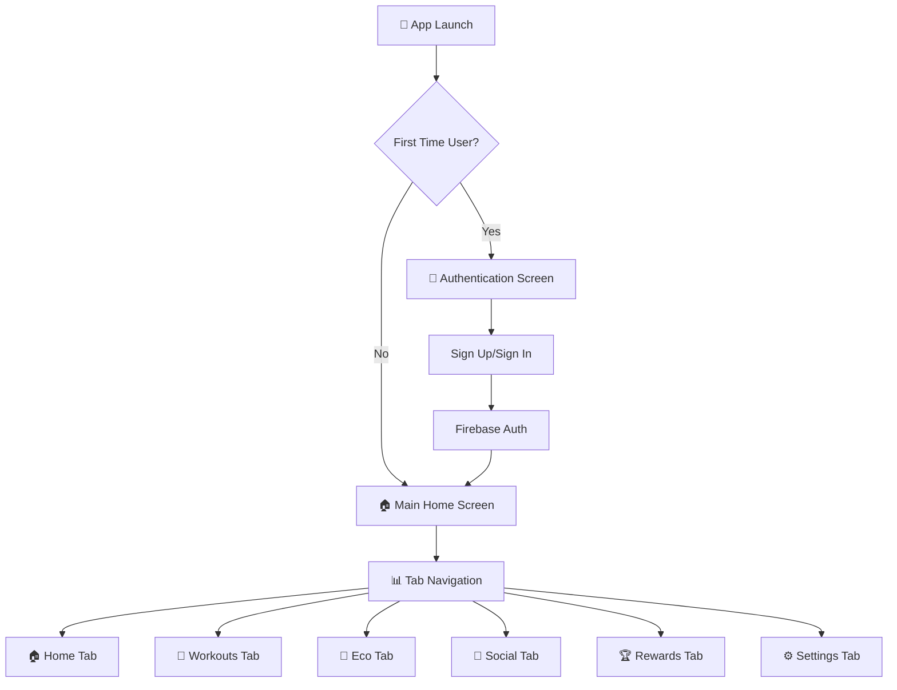
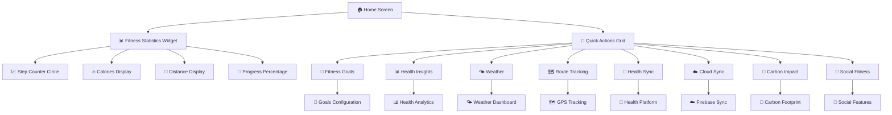
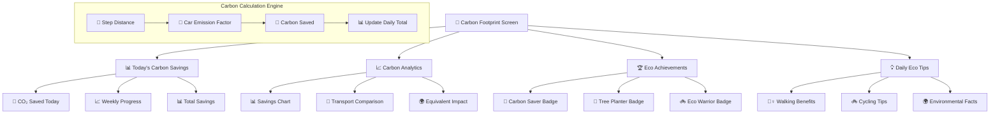
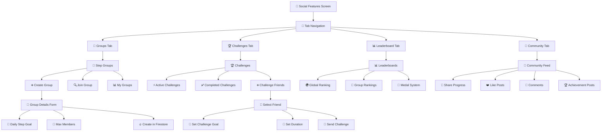
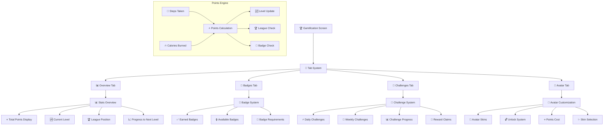
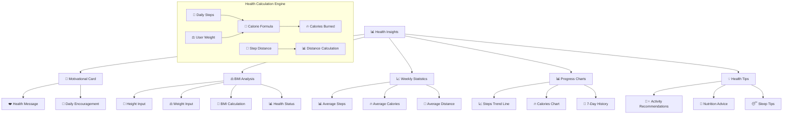
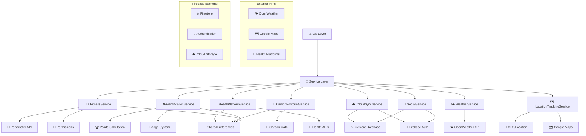
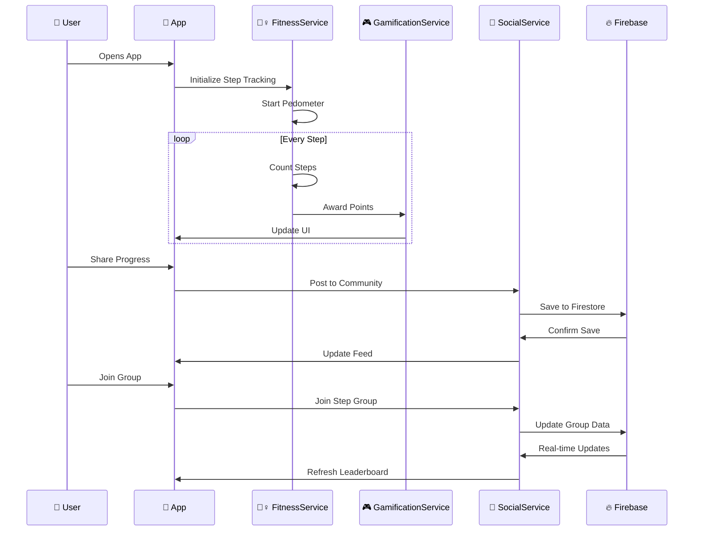

# 🏃‍♂️ BigSteppers Fitness App - Complete Flow Diagram

## 📱 App Architecture & User Flow



## 🏠 Home Screen Flow



## 🌱 Eco Features Flow



## 👥 Social Features Flow



## 🏆 Gamification Flow



## 📊 Health Insights Flow



## ⚙️ Settings & Configuration Flow

```mermaid
graph TD
    A[⚙️ Settings Screen] --> B[👤 User Profile]
    B --> B1[📷 Profile Photo]
    B --> B2[✏️ Edit Account]
    B --> B3[🔑 Change Password]
    
    A --> C[🎯 Fitness Goals]
    C --> C1[🚶 Daily Steps Goal]
    C --> C2[🔥 Daily Calories Goal]
    C --> C3[📏 Daily Distance Goal]
    C --> C4[💪 Weekly Workouts Goal]
    C --> C5[⚖️ Personal Info (Weight/Height)]
    
    A --> D[🔔 Notifications]
    D --> D1[⏰ Reminder Settings]
    D --> D2[🎯 Goal Notifications]
    D --> D3[👥 Social Notifications]
    
    A --> E[🔗 App Features]
    E --> E1[🌤️ Weather Settings]
    E --> E2[🗺️ Location Permissions]
    E --> E3[🏥 Health Platform Connection]
    E --> E4[☁️ Cloud Sync Settings]
    
    A --> F[ℹ️ About & Support]
    F --> F1[📖 Terms of Service]
    F --> F2[🔒 Privacy Policy]
    F --> F3[📧 Contact Support]
    F --> F4[🚪 Sign Out]
```

## 🔄 Data Flow & Services Architecture



## 📊 Real-time Data Synchronization



---

## 🎯 Key Features Summary

### 🏠 **Core App Flow:**
1. **Authentication** → **Home Dashboard** → **Feature Navigation**
2. **Real-time Step Tracking** with **Background Monitoring**
3. **6-Tab Navigation** for **Organized Feature Access**

### 🌟 **Major Feature Flows:**
- **🌱 Eco Tracking**: Steps → Carbon Calculation → Environmental Impact
- **👥 Social Features**: Groups → Challenges → Leaderboards → Community
- **🏆 Gamification**: Points → Badges → Levels → Avatars
- **📊 Health Insights**: Data Analysis → BMI → Progress Trends

### 🔧 **Technical Architecture:**
- **Service-Based Architecture** with **Clean Separation**
- **Firebase Backend** for **Real-time Social Features**
- **Local Storage** with **Cloud Synchronization**
- **Background Processing** for **Continuous Tracking**

This comprehensive flow diagram shows how BigSteppers creates an engaging, feature-rich fitness experience that motivates users through gamification, social connection, and environmental awareness! 🎉
